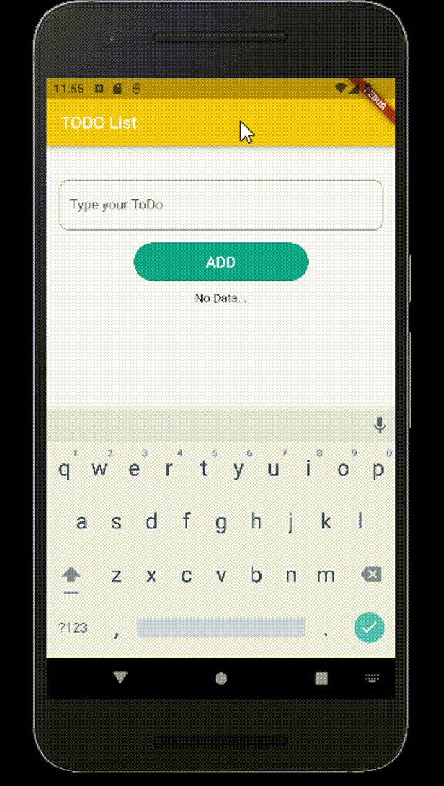

<h1>Flutter ToDo App</h1>

This app created to understand Flutter. It is a basic app that made me to understand state usage, OOP, dart, sizing widgets, aligment of elements and the class structure. On next project I will try more comlicated structures.

<h2>Screen Emulator</h2>

For screen emulator Nexus_6P API 31 was used.

<h2>Screan Gif</h2>

